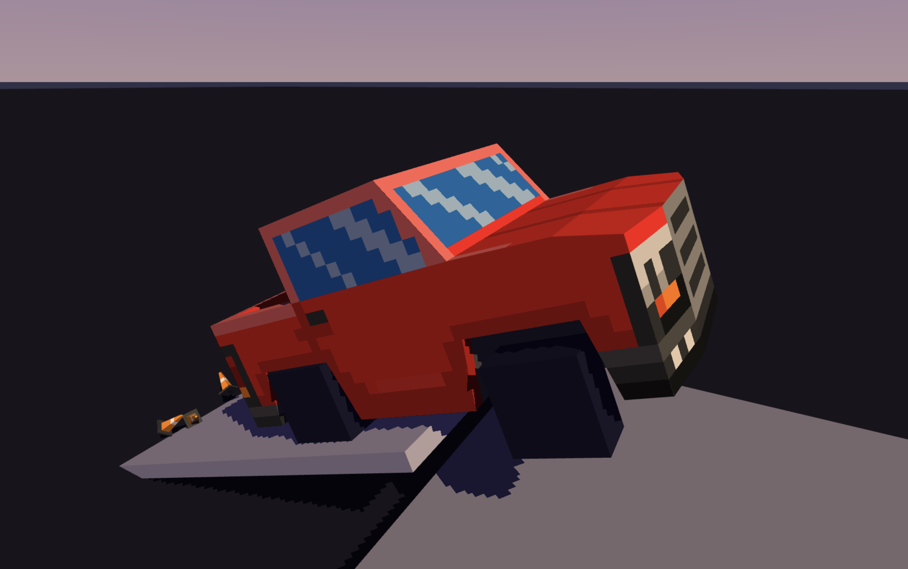

# Wildcar

Learning about 3D rendering and car physics.




## Controls
* P: Toggle pause.
* F: Toggle fullscreen.


## Integrated editor

### Controls
* F1: Cycle between FPS display modes (none, number, or number and graph).
* F2: Toggle memory usage.
* F3: Cycle through camera modes (orbit or free).
    * Orbit
        * Left mouse held orbits the target.
        * Middle mouse held moves closer/farther from the target.
    * Free
        * Left mouse held changes facing direction.
        * Middle mouse held moves forward/backward.
        * WASD: Moves left/right and forward/backward (hold shift for faster movement).
* F4: Toggle showing collision bodies.
* F5: Toggle showing suspension.
* F6: Toggle reset scene on reload.
* F7: Toggle reset camera on reload.
* G: Toggle game state inspector.


## Development
This project is built using the zig build system, use `zig build -h` for a list of options or look at the `build.zig` file for more details.

Examples
```
# Run game.
zig build run

# Build an optimized, release build of the game.
zig build -Doptimize=ReleaseFast -Dinternal=false
```
